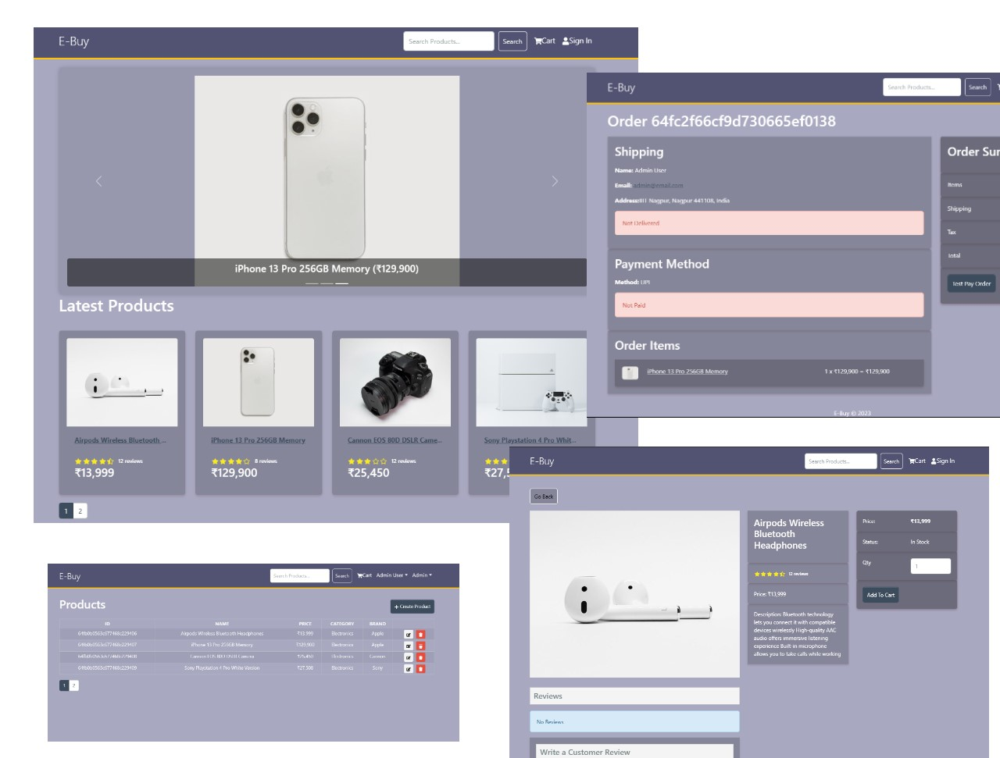

# E-Buy eCommerce Platform 

> eCommerce platform built with the MERN stack & Redux.



This project is part of my [MERN Stack From Scratch | eCommerce Platform](https://www.traversymedia.com/mern-stack-from-scratch) course. It is a full-featured shopping cart with credit/debit payments. See it in action [here](http://proshopapp.herokuapp.com/).

This is version of the app, which uses Redux Toolkit.

## Features

- Full featured shopping cart
- Product reviews and ratings
- Top products carousel
- Product pagination
- Product search feature
- User profile with orders
- Admin product management
- Admin user management
- Admin Order details page
- Mark orders as delivered option
- Checkout process (shipping, payment method, etc)
- Credit card integration
- Database seeder (products & users)

## Usage

- Create a MongoDB database and obtain your `MongoDB URI` - [MongoDB Atlas](https://www.mongodb.com/cloud/atlas/register)

### Env Variables

In `.env` file, add the following

```
NODE_ENV = development
PORT = 5000
MONGO_URI = your mongodb uri
JWT_SECRET = 'abc123'
PAGINATION_LIMIT = 4
```

Change the JWT_SECRET and PAGINATION_LIMIT to what you want

### Install Dependencies (frontend & backend)

```
npm install
cd frontend
npm install
```

### Run

```

# Run frontend (:3000) & backend (:5000)
npm run dev

# Run backend only
npm run server
```

## Build & Deploy

```
# Create frontend prod build
cd frontend
npm run build
```

### Seed Database

You can use the following commands to seed the database with some sample users and products as well as destroy all data

```
# Import data
npm run data:import

# Destroy data
npm run data:destroy
```

```
Sample User Logins

admin@email.com (Admin)
123456

user@email.com (Customer)
123456

jane@email.com (Customer)
123456
```

